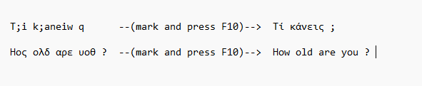
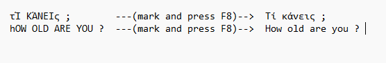

# GR–EN Keyboard Fixer (AutoHotkey)

Utility script that fixes text typed with the wrong **Greek ↔ English keyboard layout** and toggles **UPPER/lower case** for selected text.

## Features
- **F10**: Convert selected text between **Greek ↔ English keyboard layouts** (wrong-layout fix)
- **F8**: Toggle case for selected text (**Greek-aware**; handles accented characters and common edge cases)

## How to use
1. Install AutoHotkey.
2. Run `gr-en-keyboard-layout-and-case.ahk`.
3. Select text in any application.
4. Press **F10** to fix the keyboard layout, or **F8** to toggle case.

## Examples

### F10 — Keyboard layout fix (Greek ↔ English)

### F8 — Case toggle

## Notes
- The script uses clipboard-based text processing and character mapping.
- Hotkeys can be changed by editing the script.

## License
MIT
